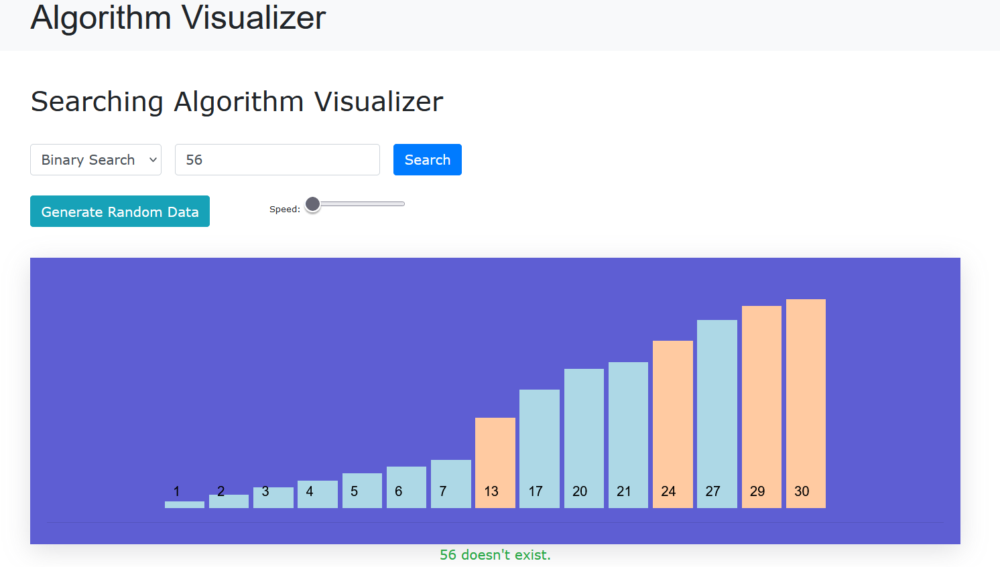
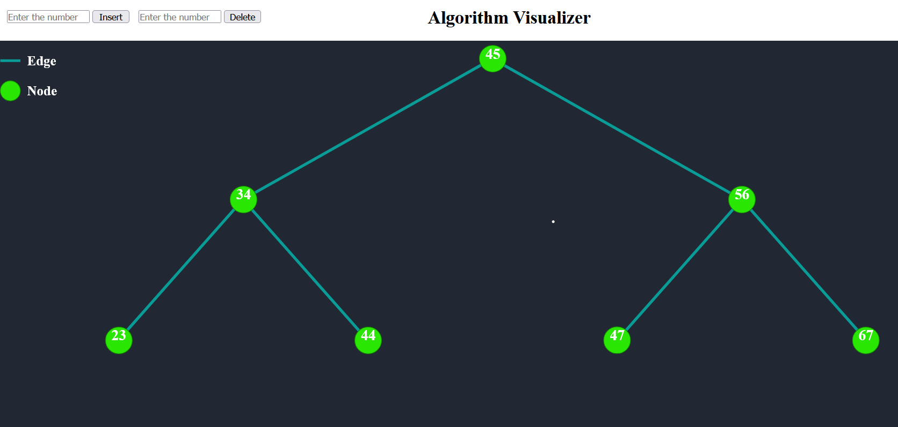

# Algorithm Visualizer Web Application

## Introduction

The **Algorithm Visualizer Web Application** is a single-page web application designed to provide a visual representation of various algorithms, including searching, sorting, graph traversal, and tree-based algorithms. Utilizing modern JavaScript technology, this application serves as an educational tool to help users understand the underlying logic and processes of these algorithms through interactive visualizations.

---

## Need for Visualization

### Visualization

Visualization is the graphical representation of ideas, concepts, data, and processes. It plays a critical role in simplifying complex information, making it easier to understand and communicate. From ancient cave paintings to modern data visualizations, the ability to visually depict information has been a cornerstone of human communication.

In today's data-driven world, where information is abundant and often complex, effective visualization is essential. It transforms abstract ideas into tangible representations, enabling quicker comprehension and decision-making. Visualization enhances the communication of fundamental concepts, making them more accessible and engaging.

---

## Objective

The primary objective of this project is to develop a web application that functions as a visualization tool for various algorithms. The application is designed with the following goals:

1. **Searching Algorithms Visualization**:
   - The UI allows users to select from a range of implemented searching algorithms.
   - Users can input an array of elements, choose an algorithm, and visualize the search process step-by-step.
   - Additional features include an element input field, a search initiation button, and a sound toggle for audio feedback.

2. **Sorting Algorithms Visualization**:
   - The UI provides options to select from various implemented sorting algorithms.
   - Users can generate a random data array, adjust sorting speed, and choose color modes.
   - The sorting process is visualized with vertical bars representing array elements, and the UI updates in real-time to show the sorting progression.

3. **Graph Algorithms Visualization**:
   - The UI allows users to select and visualize graph algorithms on a matrix of nodes.
   - Users can designate start, end, and obstacle nodes, and initiate the visualization of the algorithm's pathfinding process.
   - The interface also includes options for clearing the grid and adjusting color modes.

4. **Binary Search Tree (BST) Visualization**:
   - The UI includes options for inserting and removing nodes in a BST.
   - Users can interactively visualize the structure of the BST as nodes are added or removed.

---
## Homepage

## Features

- **Intuitive Interface**: User-friendly design with clear options for selecting algorithms and customizing the visualization.
- **Interactive Visualizations**: Step-by-step representation of algorithms to enhance understanding.
- **Customizable Settings**: Options for adjusting visualization speed, color modes, and more.
- **Educational Tool**: Designed to help users, particularly students and educators, grasp the concepts of algorithmic processes.

---

## Screenshots

### Searching Algorithm Visualizer


### Sorting Algorithm Visualizer


### Graph Algorithm Visualizer


### Binary Search Tree Visualizer


---

## Technologies Used

- **HTML/CSS**: For structuring and styling the web application.
- **JavaScript**: Core language used for implementing the algorithms and visualizations.
- **React.js** (if applicable): For building the interactive UI components.

---

## How to Run

1. Clone the repository:
   ```bash
   git clone https://github.com/yourusername/algorithm-visualizer.git
